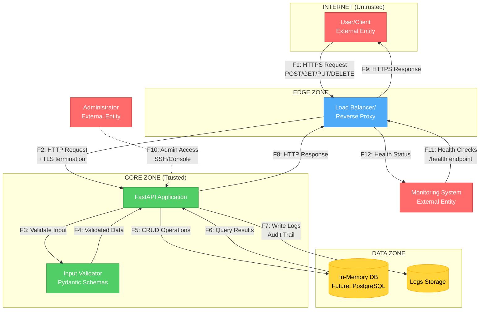
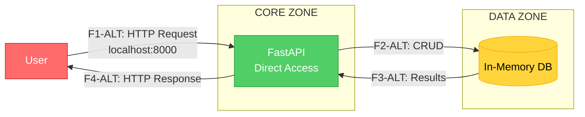

# Data Flow Diagram (DFD)

## Обзор
Данный документ содержит диаграмму потоков данных (DFD) для Wishlist API с отмеченными границами доверия, внешними участниками, хранилищами данных и пронумерованными потоками.

## Границы доверия
- **Client Zone** - внешняя недоверенная зона (браузеры, мобильные приложения)
- **Edge Zone** - граница периметра (reverse proxy, load balancer)
- **Core Zone** - доверенная зона приложения (FastAPI backend)
- **Data Zone** - зона хранения данных (database, cache)

## DFD Диаграмма

## Описание потоков данных

### Основные потоки (пользовательские)

| ID | Поток | Протокол | Описание | Данные |
|---|---|---|---|---|
| **F1** | User → Load Balancer | HTTPS | Пользовательские запросы к API | JSON: WishCreate, WishUpdate, query params |
| **F2** | Load Balancer → FastAPI | HTTP | Проксирование запросов после TLS termination | HTTP запросы с заголовками |
| **F3** | FastAPI → Input Validator | Internal | Валидация входных данных | Pydantic models |
| **F4** | Input Validator → FastAPI | Internal | Валидированные данные | Validated DTO |
| **F5** | FastAPI → Database | Internal | Операции CRUD | Structured data (dict) |
| **F6** | Database → FastAPI | Internal | Результаты запросов | Query results |
| **F7** | FastAPI → Logs | Internal | Запись логов и аудита | Log entries, timestamps |
| **F8** | FastAPI → Load Balancer | HTTP | Ответы приложения | JSON responses |
| **F9** | Load Balancer → User | HTTPS | Зашифрованные ответы клиенту | JSON over HTTPS |

### Вспомогательные потоки

| ID | Поток | Протокол | Описание | Данные |
|---|---|---|---|---|
| **F10** | Administrator → FastAPI | SSH/Console | Административный доступ (деплой, конфигурация) | Commands, configs |
| **F11** | Monitoring → Load Balancer | HTTPS | Проверки доступности | Health check requests |
| **F12** | Load Balancer → Monitoring | HTTPS | Статус системы | {"status": "ok"} |

## Альтернативный сценарий: Прямое подключение к API

В режиме разработки или при деплое без reverse proxy:

| ID | Поток | Протокол | Описание | Примечание |
|---|---|---|---|---|
| **F1-ALT** | User → FastAPI (direct) | HTTP | Прямой доступ без proxy | Только для разработки |
| **F2-ALT** | FastAPI → DB | Internal | Операции с данными | Те же операции |
| **F3-ALT** | DB → FastAPI | Internal | Результаты | Те же данные |
| **F4-ALT** | FastAPI → User | HTTP | HTTP ответы | Нет HTTPS |

## Точки входа и границы

### Точки входа (Entry Points)
1. **Public API** (`F1`) - основная точка входа для пользователей
2. **Health Check** (`F11`) - мониторинг доступности
3. **Admin Access** (`F10`) - административный доступ

### Границы доверия (Trust Boundaries)
1. **Internet → Edge** - между F1 и F2 (TLS termination)
2. **Edge → Core** - между F2 и F3 (внутренняя сеть)
3. **Core → Data** - между F5 и DB (data access layer)

## Ключевые замечания

1. **TLS Termination** происходит на уровне Load Balancer (граница Edge→Core)
2. **Input Validation** выполняется через Pydantic до обработки бизнес-логики
3. **Logging** охватывает все критические операции для аудита
4. **In-Memory DB** - текущее решение, планируется миграция на PostgreSQL
5. **Authentication/Authorization** пока отсутствует (будущая доработка)

## Связь с NFR

- **NFR-004** (Безопасность) - защита на границах доверия, HTTPS для F1/F9
- **NFR-005** (Валидация) - поток F3/F4 через Pydantic
- **NFR-006** (Логирование) - поток F7 для аудита
- **NFR-007** (Масштабируемость) - Load Balancer позволяет добавлять реплики
